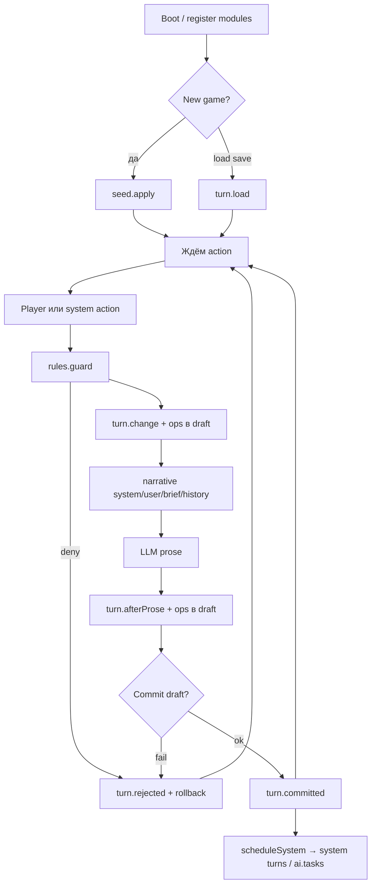

# SDK reference — полный каталог `@rpengineext/module-sdk`

> **Normative SDK 1.0** (Module Platform 1.0 · frozen).
> Для авторов модулей. Это **карта возможностей**, не tutorial.
> Старт за 5 минут: [README.md](./README.md) · Паттерны: [recipes.md](./recipes.md) · Zod: [schemas.md](./schemas.md)
> Политика совместимости: [compatibility.md](./compatibility.md) · Коды ошибок: [errors.md](./errors.md) · Конвенции: [conventions.md](./conventions.md)

Единственная публичная точка входа: **`defineModule`**.  
Пакет: `@rpengineext/module-sdk`.

---

## 1. Mental model

| Понятие | Смысл |
|---------|--------|
| **Модуль** | Кусок геймплея: state + реакции на ход + вклад в narrative/UI/AI |
| **Slice** | JSON-объект модуля в `WorldState.slices` (сейв) |
| **Op** | Именованная чистая функция `slice + payload → nextSlice`; попадает в journal |
| **Capability** | Декларативный блок («умею state», «умею guard», …) |
| **Moment** | Точка lifecycle хода (`change`, `afterProse`, …), **не** stage pipeline core |
| **`ctx`** | Контекст хендлера: чтение мира + `op` / `deny` / `scheduleSystem` |
| **IR** | Скомпилированный артефакт модуля; core ставит его через `compiled.install` |

### Жёсткие правила

1. **Писать state** можно только через `ctx.op` / `ctx.proposeOp` (и seed/`apply` op).  
2. **Ход атомарный**: либо commit всего draft, либо reject и откат.  
3. **Чужой slice** — только read (если объявлен `access.read`), никогда write.  
4. **Свой LLM SDK** в модуле запрещён — только `ai.tasks` / `ai.tools` движка.  
5. **`deny(code, message)`** бросает отказ; не нужно возвращать `Result`.

### Два синтаксиса — одна модель

```ts
// Object sugar (чаще)
defineModule({ id, version, title, state, turn, narrative })

// Composition (крупные модули)
defineModule({
  id, version, title,
  capabilities: [stateCap({…}), turnCap({…}), narrativeCap({…})],
})
```

Sugar и `capabilities[]` **нормализуются в один список**. Можно смешивать.

Экспорт helpers: `stateCap`, `seedCap`, `rulesCap`, `turnCap`, `narrativeCap`, `aiCap`, `hostCap`, `configCap`, `accessCap`, `eventsCap`.

---

## 2. Lifecycle хода



### Что можно в каждом moment

| Moment | Когда | `ctx.op` | `deny` | `scheduleSystem` | `passage` | `readModel` | `emit` |
|--------|--------|----------|--------|------------------|-----------|-------------|--------|
| `seed.apply` | new game, есть meta | да | да* | нет | нет | да | нет (fail-loud) |
| `rules.guard` | до изменений | **нет** (fail-loud) | **да** | нет | нет | да | нет (fail-loud) |
| `rules.soft` | предупреждения | **нет** (fail-loud) | нет | нет | нет | да | нет (fail-loud) |
| `turn.change` | до narrative/LLM | **да** | да | нет | нет | да | нет (fail-loud) |
| `narrative.*` | сбор prompt | **нет** (fail-loud) | нет | нет | нет | да | нет (fail-loud) |
| `turn.afterProse` | prose известен, ещё draft | **да** | да | нет | **да** | да | нет (fail-loud) |
| commit | core | — | — | — | — | — | — |
| `turn.committed` | после успешного commit | **нет** (**fail-loud**, не silent-drop) | нет | **да** | **да** (read) | да | **да** |
| `turn.rejected` | после отказа | **нет** (fail-loud) | нет | нет | нет | да | **да** |
| `turn.load` | загрузка сейва | **нет** (fail-loud) | — | нет | нет | да | нет (fail-loud) |
| `ai.tools.handler` | tool round агента | **`proposeOp`** | да | нет | — | да | нет (fail-loud) |
| `rules.invariant` | проверка slice | **нет** (fail-loud) | да* | нет | — | n/a | нет (fail-loud) |
| `event.dispatch` | подписчик события (post-outcome) | **нет** (**fail-loud**) | **нет** (**fail-loud**) | **да** | нет | да | **да** (capped) |

\* `deny` в op `apply` / invariant — отказ операции или хода (см. core failure codes).  
Guard должен **резать** ход через `deny`, а не «тихо править» мир.

**Write-forbidden moments:** вызов `ctx.op` / mutate → стабильный код `MODULE_MOMENT_OP_FORBIDDEN` (spec 03 E15). Тихий collect-and-drop **запрещён**.  
**`ctx.readModel(name)`:** либо данные, либо fail loud `MODULE_READ_MODEL_UNKNOWN` — **без** silent `undefined`, во всех моментах (spec 06 E10).  
**`ctx.emit`:** только в post-outcome моментах (`committed` / `rejected` / `event.dispatch`); в остальных → fail-loud `MODULE_EVENT_EMIT_FORBIDDEN` (E19; mid-turn — reject хода).

`priority` модуля: **меньше = раньше** (default `100`). Bands: infra 0–9, world 10–29, entities 30–59, systems 60–79, presentation 80–99 (см. conventions / spec 04).

---

## 3. `defineModule` — корень

```ts
function defineModule(
  def: ModuleDefinition,
  options?: { factoryConfig?: JsonObject; moduleConfig?: JsonObject },
): DefinedModule

function tryDefineModule(...): Result<DefinedModule, Failure>
```

### Поля `ModuleDefinition`

| Поле | Тип | Обязательно | Смысл |
|------|-----|-------------|--------|
| `id` | `string` | да | Уникальный id (kebab-case), namespace команд/tools |
| `version` | `string` | да | Semver модуля |
| `title` | `string` | да | Человекочитаемое имя |
| `description` | `string` | нет | Для UI/доков |
| `priority` | `number` | нет | Порядок moments (default 100, меньше = раньше) |
| `provides` | `string[]` | нет | Capability tokens для других `requires` |
| `requires` | `string[]` | нет | Зависимости по tokens |
| `capabilities` | `Capability[]` | нет | Composition-форма |
| `state` … `events` | object sugar | нет | См. каталог ниже |
| `init` / `shutdown` | lifecycle hooks | нет | Опциональны; нормы в §4.5 ниже |

`options.factoryConfig` — снимок конфига на фабрике (как `windowPairs` у working-memory).  
Host всё равно может переопределить через `config.moduleConfig`.

### Что возвращается

| Поле | Смысл |
|------|--------|
| `manifest` / `install` | Контракт `Module` для core |
| `definition` | Нормализованное определение |
| `ir` | `CompiledModuleIR` (всегда) |
| `compiled` | handle `install` из IR (всегда) |

Автору обычно достаточно `createXModule()` → передать в `modules: […]`.

---

## 4. Каталог capabilities

Ниже — **всё**, что sdk v1 умеет объявить.  
Примеры без Zod: схемы обозначены именами (`MoodSliceSchema`). Как их писать — [schemas.md](./schemas.md).

---

### `state`

**Зачем:** один slice модуля в сейве + журнал ops.

| Поле | Тип | Смысл |
|------|-----|--------|
| `name?` | `string` | Имя slice; default = `id` с `-` → `_` |
| `schemaVersion?` | `number` | Версия схемы (часто дублируется полем в данных) |
| `schema` | `ZodType<TSlice>` | Валидация slice |
| `initial` | `TSlice` | Значение до seed / пустая сессия |
| `ops?` | `Record<string, SliceOpDef>` | Именованные трансформации |
| `migrations?` | `Record<number, (old) => TSlice>` | Миграции со старых schemaVersion |

**Op** — либо функция, либо объект:

```ts
ops: {
  // коротко
  bump: (s, p: { by?: number }) => ({ ...s, level: s.level + (p.by ?? 1) }),

  // с валидацией payload
  set_flag: {
    payload: SetFlagPayloadSchema,
    apply: (s, p) => ({ ...s, flag: p.flag }),
  },
}
```

**Правила ops**

- Чистые: `(slice, payload) → nextSlice` (можно `deny` при невалидных данных).
- Имя op в `ctx.op("bump")` = ключ в `ops`.
- Core превращает op в `StateCommand` с namespaced type.

**Минимум**

```ts
state: {
  schema: MoodSliceSchema,
  initial: { schemaVersion: 1, level: 0 },
  ops: {
    bump: (s, p: { by?: number }) => ({
      ...s,
      level: s.level + (p.by ?? 1),
    }),
  },
}
```

**Типичные ошибки:** забыли `schemaVersion` в данных; `ctx.op("foo")` без ключа в `ops`; мутация `s` in-place вместо нового объекта.

---

### `seed`

**Зачем:** один раз при **new game** взять данные из `session.meta` и прогнать ops.

| Поле | Тип | Смысл |
|------|-----|--------|
| `fromMeta` | `string` | Ключ `session.meta[fromMeta]` |
| `parse?` | `ZodType` | Валидация raw meta |
| `when?` | `"new_game"` | Сейчас только new game |
| `apply` | `(value, ctx) => void` | Обычно `ctx.op("seed", …)` |

**Не** вызывается при load save (state уже в сейве).

```ts
seed: {
  fromMeta: "lore",
  parse: LoreMetaSchema, // например z.string().min(1)
  apply: (value, ctx) => {
    ctx.op("seed", { text: String(value).trim() }, "seed lore");
  },
}
```

Host:

```ts
await engine.startSession({ meta: { lore: "Магия вне закона." } });
```

Эталон: `module-world-canon` (`fromMeta: "worldCanon"`), `module-character` (`"character"`).

---

### `rules`

**Зачем:** жёсткие и мягкие ограничения.

| Поле | Сигнатура | Смысл |
|------|-----------|--------|
| `guard?` | `(ctx) => void` | До change: `deny(code, msg)` → reject хода |
| `soft?` | `(ctx) => string[] \| void` | Warning’и, ход не стопает |
| `invariant?` | `(slice, worldState) => void` | Инвариант slice (после ops / при проверках) |

```ts
rules: {
  guard(ctx) {
    const text =
      (ctx.normalizedAction as { text?: string } | undefined)?.text ?? "";
    if (text.includes("чит")) {
      deny("CHEAT", "Так нельзя.");
    }
  },
  soft(ctx) {
    if (/* подозрительно */) return ["Лучше уточнить намерение."];
  },
  invariant(slice) {
    const s = slice as { hp: number };
    if (s.hp < 0) deny("INVARIANT", "hp < 0");
  },
}
```

`deny` импортируется из `@rpengineext/module-sdk` (также `ModuleDenial`, `isModuleDenial`).

---

### `turn`

**Зачем:** реакция на lifecycle **без** знания pipeline stages core.

| Поле | Когда | Типичное использование |
|------|--------|------------------------|
| `change?` | до narrative | потратить ресурс, выставить флаг |
| `afterProse?` | prose есть, draft ещё открыт | память хода, извлечь факты из prose |
| `committed?` | после commit | **только observe** + `scheduleSystem` |
| `rejected?` | после reject | логирование / метрики |
| `load?` | load save | прогрев кэшей (редко) |

```ts
turn: {
  change(ctx) {
    ctx.op("bump", { by: 1 });
  },
  afterProse(ctx) {
    if (ctx.turnKind !== "player") return;
    if (ctx.action?.kind !== "free_text") return;
    const user = ctx.action.text?.trim();
    const assistant = ctx.passage?.prose.trim();
    if (!user || !assistant) return;
    ctx.op("append_pair", {
      turnId: ctx.passage!.turnId,
      user,
      assistant,
      createdAt: new Date().toISOString(),
    });
  },
  committed(ctx) {
    if (ctx.turnKind !== "player") return;
    ctx.scheduleSystem({
      reason: "my_module.sync",
      mode: "background", // или "inline"
      payload: { /* для ai task input */ },
    });
  },
  rejected(ctx) {
    ctx.note("rejected", ctx.failureCode);
  },
}
```

**Важно:** в `committed` **не** пиши state через `op` — мир уже зафиксирован.  
Platform 1.0: `ctx.op` / mutate здесь → **fail loud** `MODULE_MOMENT_OP_FORBIDDEN` (не silent-drop).  
Нужны изменения → `scheduleSystem` → system turn / tool → `proposeOp`.

Эталоны: working-memory (`afterProse`), character (`committed` + background).

---

### `narrative`

**Зачем:** вклад в prompt и brief **без** прямого вызова LLM.

| Поле | Возврат | Смысл |
|------|---------|--------|
| `system?` | `string` \| `NarrativeSectionInput` \| массив \| `null` | system-канал |
| `user?` | то же | user-канал |
| `brief?` | `JsonObject` \| `null` | структурированный brief (namespace модуля) |
| `history?` | `{ role, content }[]` | chat history для `narrative.write`; brief получит `history` |
| `style?` | `{ tone?, rating?, voice?, constraints? }` | стилевые хинты |

`NarrativeSectionInput`:

```ts
{
  id?: string;
  title?: string;
  text: string;
  priority?: number;          // меньше = выше в сборке (конвенция секций)
  channel?: "system" | "user";
}
```

```ts
narrative: {
  system: ({ slice }) => {
    const s = slice as { present: boolean; text: string };
    if (!s.present) return null;
    return {
      id: "lore.text",
      title: "LORE",
      priority: 10,
      text: s.text,
    };
  },
  user: ({ slice }) => null,
  brief: ({ slice }) => ({ present: (slice as { present: boolean }).present }),
  history: ({ slice, config }) => buildLastN(slice, config),
  style: { tone: "gritty", constraints: ["no modern slang"] },
}
```

Строка как return = простой text-section.  
`null` / `undefined` = «нечего сказать».

---

### `ai`

**Зачем:** фоновые/system agent-задачи и tools **через движок**, не через OpenAI SDK в модуле.

#### `tasks` — словарь localKey → task

| Поле | Смысл |
|------|--------|
| `description?` | Для людей / трейса |
| `input` / `output` | Zod-схемы JSON object |
| `optional?` | сбой task не валит весь product-flow |
| `timeoutMs?` | таймаут |
| `maxRepairAttempts?` | repair loop |
| `maxToolRounds?` | сколько tool round’ов |
| `temperature?` | sampling |
| `tools?` | local keys из `ai.tools` того же модуля |
| `messages` | `(input, task, ctx) => LlmMessage[]` |
| `runOn.systemReason?` | запуск, когда system turn с таким `reason` |

Local key `"outfit_sync"` → namespaced task type (модуль + key).  
`runOn.systemReason` должен совпадать с `scheduleSystem({ reason })`.

#### `tools` — словарь localKey → tool

| Поле | Смысл |
|------|--------|
| `description` | для модели |
| `args` | Zod args |
| `result?` | Zod result |
| `parametersJsonSchema?` | явный JSON Schema для tool calling |
| `handler(args, ctx)` | **не** пишет state напрямую → `ctx.proposeOp` / `ctx.op` |

```ts
ai: {
  tasks: {
    sync: {
      description: "Синхронизировать X",
      input: SyncInputSchema,
      output: SyncOutputSchema,
      optional: true,
      tools: ["apply"],
      runOn: { systemReason: "my_module.sync" },
      messages: (input) => [
        { role: "system", content: "…" },
        { role: "user", content: JSON.stringify(input) },
      ],
    },
  },
  tools: {
    apply: {
      description: "Применить изменение",
      args: ApplyArgsSchema,
      handler(args, ctx) {
        ctx.proposeOp("set_value", { value: String(args.value) });
        return { ok: true };
      },
    },
  },
}
```

Цепочка character: `committed` → `scheduleSystem({ reason, mode: "background", payload })` → system turn → task с `runOn` → tool → `proposeOp("set_outfit")`.

Полный эталон: `packages/modules/character`.

---

### `host`

**Зачем:** поверхность для CLI/UI/API **без** знания конкретного host.

| Поле | Смысл |
|------|--------|
| `status?` | `(ctx) => { slot, text }[]` — строки статус-панели |
| `help?` | `{ id, body }[]` — топики `/help` |
| `readModels?` | `Record<name, (worldState, args, config) => JsonObject>` — запросы снимков |

```ts
host: {
  status: ({ slice }) => {
    const s = slice as { name: string; outfit: string; present: boolean };
    if (!s.present) return [];
    return [
      { slot: "character.name", text: `Character: ${s.name}` },
      { slot: "character.outfit", text: `Outfit: ${s.outfit}` },
    ];
  },
  help: [{ id: "character", body: "Модуль игрового персонажа." }],
  readModels: {
    "working_memory.window": (state, _args, config) => {
      /* собрать окно истории */
      return { totalPairs: 0, history: [] };
    },
  },
}
```

`slot` — стабильный ключ для UI-раскладки.  
`readModels` получают **целый** `WorldState` (это host-facing projection, не author write-path).

---

### `config`

**Зачем:** типизированная секция `engine.config.moduleConfig[key]`.

| Поле | Смысл |
|------|--------|
| `key?` | ключ в `moduleConfig`; default ≈ имя slice |
| `schema` | Zod object |
| `defaults?` | дефолты |

```ts
config: {
  key: "working_memory",
  schema: WorkingMemoryConfigSchema,
  defaults: { windowPairs: 8 },
},
// в хендлерах:
// ctx.config.windowPairs
```

Host:

```ts
createEngine({
  modules: [createWorkingMemoryModule({ windowPairs: 12 })],
  config: {
    moduleConfig: { working_memory: { windowPairs: 12 } },
  },
});
```

Фабрика может зафиксировать дефолт вторым аргументом:

```ts
defineModule({ /* … */ }, { factoryConfig: { windowPairs: 12 } });
```

---

### `access`

**Зачем:** явный whitelist **чтения** чужих slice.

| Поле | Смысл |
|------|--------|
| `read?` | `string[]` — имена slice |

```ts
access: { read: ["character", "world_canon"] },
// …
turn: {
  change(ctx) {
    const pc = ctx.readSlice<{ outfit: string }>("character");
    // ctx.op по-прежнему только в СВОЙ slice
  },
}
```

Без `access.read` `readSlice` чужого имени не должен использоваться как контракт.  
**Write** в чужой slice не существует в sdk v1.  
Для стабильных cross-module запросов используй **`ctx.readModel`** (см. ниже §5 и conventions.md §6).

---

### `events`

**Зачем:** push-уведомления между модулями без module→module deps (spec 06 §7).

| Поле | Тип | Смысл |
|------|-----|--------|
| `emit` | `EmitDecl[]` | события, которые модуль может публиковать |
| `subscribe` | `SubscribeDecl[]` | статические подписки |

```ts
interface EmitDecl {
  name: string;                    // local kebab-case; canonical = <moduleId>.<name>
  schema?: z.ZodType<JsonObject>;  // payload validation
  description?: string;
}

interface SubscribeDecl {
  name: string;                    // canonical event name (dot-полное)
  priority?: number;               // default 100; меньше = раньше
  handler(ctx: ModuleCtx, event: { payload: JsonObject }): void | Promise<void>;
}
```

```ts
events: {
  emit: [{ name: "changed", schema: ChangedPayloadSchema }],
  subscribe: [
    {
      name: "other_mod.changed",
      handler(ctx, { payload }) {
        // observe-only: readModel / свой slice ок; op/deny → fail-loud
        ctx.scheduleSystem({ reason: "my_mod.follow_up", mode: "background" });
      },
    },
  ],
},
```

**Нормы (locked):**

- canonical name = `<moduleId>` (`-` → `_`) + `.` + local kebab; один publisher на имя → duplicate = boot fail `MODULE_EVENT_DUPLICATE` (E16).
- Подписка на неизвестное имя: publisher загружен → boot fail `MODULE_EVENT_UNKNOWN` (E17); publisher не загружен без `requires` → boot warning + инертна.
- Dispatch только в `committed` / `rejected` / `event.dispatch`; payload валидируется schema publisher'а (E18); emit в других моментах → `MODULE_EVENT_EMIT_FORBIDDEN` (E19).
- Хендлеры observe-only: `ctx.op`/`proposeOp` → `MODULE_MOMENT_OP_FORBIDDEN` (E15); `deny()` → `MODULE_EVENT_DENY_FORBIDDEN` (E20); `scheduleSystem` — ok; `emit` — ok (каскад, caps E22/E23: depth 8, burst 256/turn).
- Handler throw post-commit → turn committed + warning `MODULE_EVENT_HANDLER_ERROR` (E21), мир не меняется.
- События эфемерны (turn-scoped), в save не пишутся; подписки статичны.

### Lifecycle hooks: `init` / `shutdown` (spec 06 §8)

Опциональны, модуль-level (не capability kind):

```ts
defineModule({
  id, version, title,
  async init(ctx) { /* once, после boot-валидации, до первого turn */ },
  async shutdown() { /* cleanup only, при stop engine */ },
});
```

| Правило | Значение |
|---------|----------|
| `init` timing | после полной boot-валидации (registry, requires, events graph), до seed/turn; runs once |
| `init` ctx | **без world-доступа**: config + log; op / emit / deny / readModel / access → fail-loud `MODULE_MOMENT_OP_FORBIDDEN` (message указывает `init`) |
| `init` ordering | priority asc, sequential (детерминизм) |
| `init` failure | **boot fail** `MODULE_INIT_FAILED` (E24); engine не стартует; shutdown для не-инициализированных модулей не вызывается |
| `shutdown` timing | при engine stop / dispose; **reverse priority** (последний init — первый shutdown) |
| `shutdown` ctx | нет ctx; cleanup only; error → warning `MODULE_SHUTDOWN_ERROR` (E25), stop не валится |
| Persistence | init/shutdown не пишут в save; при init-фейле мир/сейв не создаются |

---

## 5. `ModuleCtx` — полный reference

Доступен в хендлерах capabilities (тип `ModuleCtx<TSlice, TConfig>`).

### Поля (чтение)

| Поле | Тип (смысл) | Где обычно есть |
|------|-------------|-----------------|
| `moduleId` | id модуля | всегда |
| `sliceName` | имя slice | всегда |
| `slice` | текущий draft-aware slice | всегда |
| `config` | moduleConfig секция | всегда (может быть `{}`) |
| `meta` | `session.meta` | seed / ход |
| `log` | `TurnLogger` | ход |
| `turnId` / `sessionId` | ids | ход |
| `action` | сырой `PlayerAction` | player turn |
| `normalizedAction` | нормализованный ввод | после normalize |
| `intent` | `ActionIntent` | если есть intent stage |
| `passage` | `{ turnId, prose, … }` | afterProse, committed |
| `turnKind` | `"player"` \| `"system"` \| … | ход |
| `locale` | локаль | если host задал |

### Методы

| Метод | Смысл | Где уместно |
|-------|--------|-------------|
| `op(name, payload?, reason?)` | предложить state op → StateCommand | seed, change, afterProse, tools only |
| `proposeOp(...)` | алиас `op` (семантика та же) | ai tool handlers |
| `readSlice<T>(name)` | прочитать slice | свой slice или `access.read` |
| `readModel(name, args?)` | стабильный cross-module query | любой момент; unknown → `MODULE_READ_MODEL_UNKNOWN` (E10) |
| `emit(name, payload?)` | публикация события | **`committed` / `rejected` / `event.dispatch` only**; иначе `MODULE_EVENT_EMIT_FORBIDDEN` (E19) |
| `scheduleSystem({ reason, payload?, mode? })` | очередь system turn | **committed** only / event handler |
| `note(title, body?, data?)` | запись в turn trace | отладка |

Write-forbidden moments (`committed`, `narrative.*`, `guard`, `event.dispatch`, `init`, …): `op`/`proposeOp` → `MODULE_MOMENT_OP_FORBIDDEN`.  
`readModel`: либо JSON object, либо fail loud `MODULE_READ_MODEL_UNKNOWN` — **без** silent `undefined` (все моменты, включая narrative).

`ScheduleSystemRequest.mode`: `"background"` | `"inline"` (как использует character).

### Глобально рядом с ctx

```ts
import { deny } from "@rpengineext/module-sdk";
deny("CODE", "Человекочитаемое сообщение"); // throws ModuleDenial
```

---

## 6. Утилиты и прочий public API

| Экспорт | Зачем |
|---------|--------|
| `defineModule` / `tryDefineModule` | вход автора |
| `deny` / `ModuleDenial` / `isModuleDenial` | отказ |
| `*Cap` helpers | composition-форма |
| `MODULE_SDK_VERSION` / `MODULE_IR_VERSION` | версии |
| `defaultSliceName(id)` | `my-mod` → `my_mod` |
| `commandType(moduleId, op)` | namespaced command type |
| `namespacedId(...)` | стабильные id |
| `asJsonSchema(zod)` | Zod → JSON Schema helper |
| `normalizeModuleDefinition` | advanced / tooling |
| types: `ModuleDefinition`, `ModuleCtx`, capability interfaces, `DefinedModule` | TypeScript |

Тестовый harness (отдельный subpath) — **author SoT** (spec 02):

```ts
import {
  testModule, testModules,           // boot
  expectCommitted, expectRejected,   // asserts
  expectSlice, expectEvent,
  fixedProseLlm, scriptedToolLlm,    // LLM mocks
} from "@rpengineext/module-sdk/test";
// advanced/maintainer only:
// import { createTestEngine } from "@rpengineext/core/testing";
```

Harness surface: `turn(text)` · `action(action)` · `systemTurn(reason, payload?)` · `waitIdle(timeoutMs?)` · `save()` / `load(pointer)` · `slice` / `sliceOf(name)` · `state()` · `readModel(name, args?)` · `events` log (read-only, cleared on load) · `stop()`.

Options: `{ meta, moduleConfig, llm, agentsMode, seed, strictCapabilities, persistence }` — `strictCapabilities` default **true**.

---

## 7. Чего SDK **не** даёт (v1)

| Нельзя | Вместо этого |
|--------|----------------|
| Мутировать `ctx.slice` / `worldState` руками | `ctx.op` в write-allowed moments |
| `ctx.op` в `committed` / narrative / guard / init | `scheduleSystem` + system turn / tool; иначе fail loud |
| Писать в чужой slice | свой op; cross-read via `access.read` / `readModel` |
| Silent `readModel` miss | fail `MODULE_READ_MODEL_UNKNOWN` (все моменты) |
| `ctx.emit` вне post-outcome | fail `MODULE_EVENT_EMIT_FORBIDDEN` |
| `deny()` в event handler | fail `MODULE_EVENT_DENY_FORBIDDEN`; follow-up через `scheduleSystem` |
| Звать OpenAI/Anthropic SDK | `ai.tasks` / tools |
| Подписываться на произвольные pipeline stages | moments `turn.*` / `rules.*` / `seed` |
| Ждать «полу-commit» | атомарный draft |
| Считать ports (`ModuleRegisterContext`, …) author API | только maintainers |
| Несколько slice на модуль | v1: **один** primary slice |
| Runtime dep на другой `module-*` | provides/requires + readModel/access/events |

---

## 8. Порядок «что объявить» на практике

1. `id` / `version` / `title` / `priority`  
2. `state` (schema + initial + ops)  
3. Нужен story JSON? → `seed`  
4. Нужны запреты? → `rules`  
5. Когда менять мир? → `turn.change` и/или `afterProse`  
6. Что видит LLM? → `narrative`  
7. Нужен UI? → `host`  
8. Тюнинг? → `config`  
9. Фон / агент? → `turn.committed` + `ai`  
10. Чужие данные read-only? → `access` / `ctx.readModel`  
11. Уведомления другим модулям? → `events` (emit в committed/rejected)  
12. Внешние ресурсы при boot? → `init` / `shutdown`

---

## 9. Связанные документы

| Документ | Роль |
|----------|------|
| [README.md](./README.md) | старт |
| [recipes.md](./recipes.md) | копируемые паттерны |
| [schemas.md](./schemas.md) | Zod |
| [ADR 0004](../adr/0004-module-sdk-cbmd.md) | почему CBMD / sdk |
| [ADR 0005](../adr/0005-moments-native-core.md) | deferred: моменты-native core (не реализовано) |
| Эталоны | `packages/modules/{world-canon,working-memory,character,summary}` |
